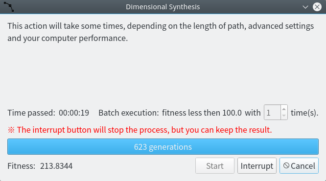
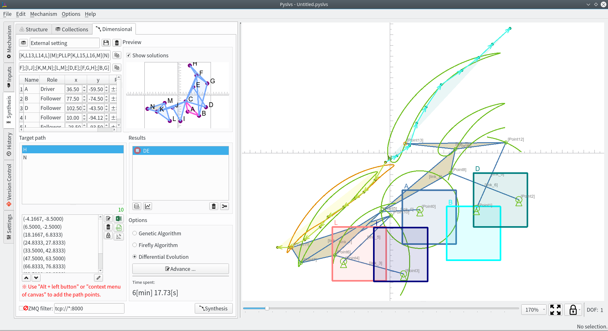

+ Ball lifter mechanism synthesis test 提球機構合成測試

<!-- PELICAN_END_SUMMARY -->

Ball lifter mechanism synthesis test 提球機構合成測試
===

The new synthesis options will support algorithms that end with fitness, and we will conduct small calculations for ball lifter mechanisms with two target paths.

新的合成設定中將支援隨適應值結束演算法，針對有兩個目標路徑的提球機構展開小型演算測試。

The construction of the ball lifter mechanism is so variable that it takes 6 minutes to 20 minutes to calculate the fitness below 100.

提球機構的變數較多，導致演算適應值至 100 以下的所需時間為 6 分鐘到 20 分鐘不等。

In addition, the staggered position of two target paths will also affect the result.

另外，兩段目標路徑的交錯位置也會影結果。