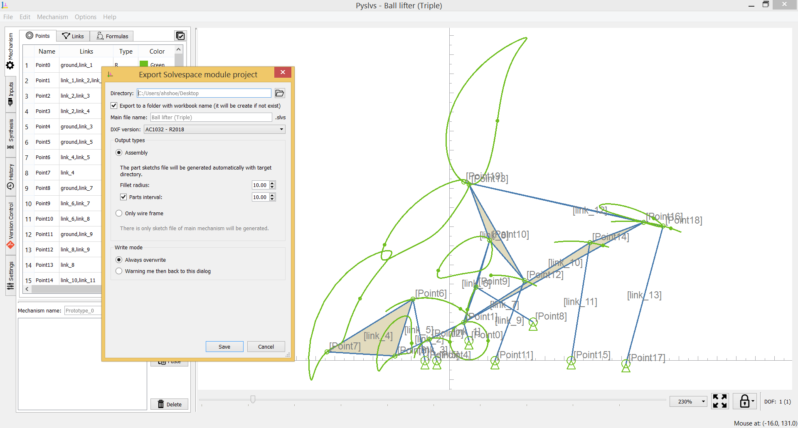
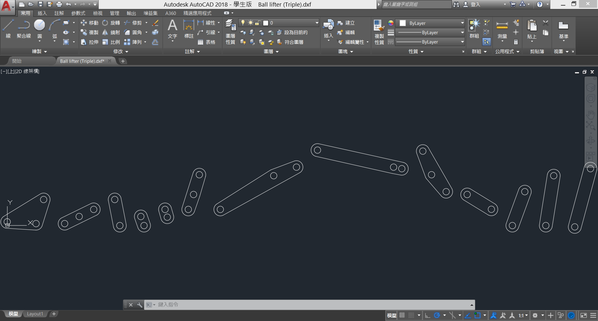

+ Enhanced DXF format exporting function.

+ Linkage length free move mode.

<!-- PELICAN_END_SUMMARY -->

DXF support
===

Support versions:

+ R12
+ R2000
+ R2004
+ R2007
+ R2010
+ R2013
+ R2018

(User interface are in the test version.)

Demo video
===

Now expression table widget finally has a selection mode.

Choose a length parameter to change linkage dimension by slide bar or spin box.

<iframe width="560" height="345" src="https://www.youtube.com/embed/uJ5pj4JgoLw" frameborder="0" allow="autoplay; encrypted-media" allowfullscreen></iframe>
