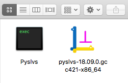

+ Mac OS platform supported.

<!-- PELICAN_END_SUMMARY -->

Mac OS platform
===

Python-Solvespace kernel is already supported with macOS!

Two types of executable files will be generated by PyInstaller.

+ Unix-like executable file can execute in command line, but it will open external shell window when using "open" command.
+ Common "app" format can execute with "open" command, but cannot pass arguments directly.

