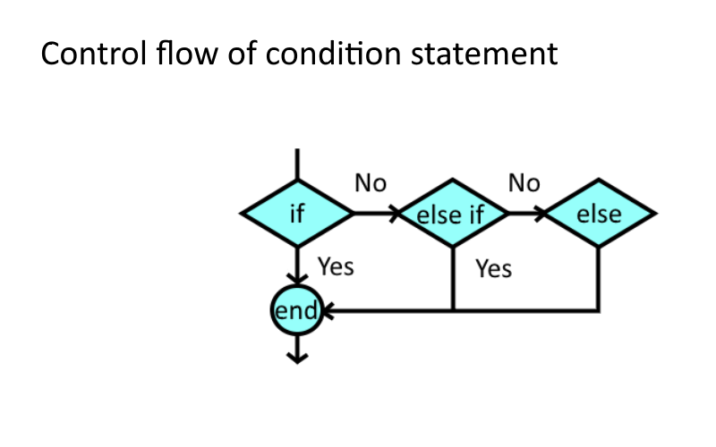
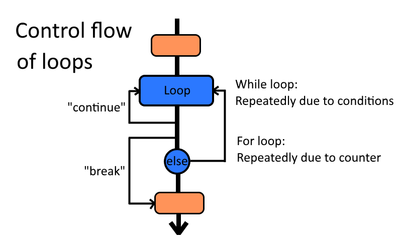
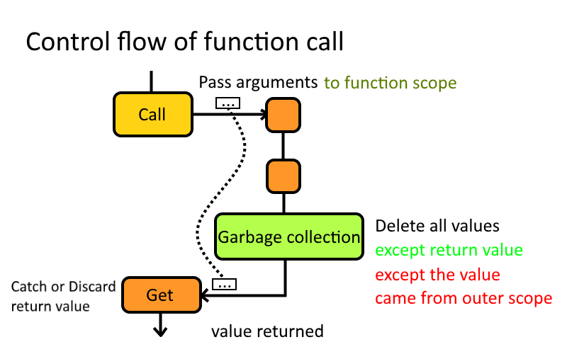

<!-- PELICAN_END_SUMMARY -->

請學員從下列圖片中的控制流程方法對應 Python 中的語法。



```python
# Condition statement
if condition_1:
    # Do for condition 1.
elif condition_2:
    # Do for condition 2.
else:
    # Do for other case.
```



```python
# Loops
for i in range(10):
    if i == 4:
        continue
    # Do for 0~9 except 4.

k = 'b'
w = ['a', 'b', 'c', 'd', 'e']
while w:  # Condition: 'w' is not empty.
    if k == w.pop():  # Remove last one and compare it with 'k'.
        break  # Stop the loop if k is equal with last one.
print(w)  # w = ['a']
```

```python
# note: "for" loop is done with "while" loop.
for c in ['a', 'b', 'c']:
    if c == 'b':
        continue
    # Do for 'a'~'c' except 'b'.

i = 0
c_list = ['a', 'b', 'c']
while i < len(c_list):  # 'i' is in the range of length of 'c_list'.
    c = c_list[i]  # Get the value from 'c_list'.
    if c == 'b':
        continue
    # Do for 'a'~'c' except 'b'.
    i += 1  # 'i' increase 1.
```



```python
# Define a function 'func'.
def func(a, b):
    c = int(a)  # Copy 'a' and turn it to a integer, and save it to 'c'.
    if c > 30:  # If 'c' is over 30, set it to 30.
       c = 30
    return b - c  # Return a value that obtained by 'b' minus with 'c'.
    # Garbage collecting for 'a', 'b', 'c'. Except 'b' - 'c'.

# Use the function.
d = func(27.9705, 50)  # 'd' is 23.
d -= func('70', d)  # 'd' minus -7, so 'd' will be set to 30.
func(30.5, d)  # Return value is 0, but it will be discarded and deleted.
```

```python
# The following statements are the same in the last line of function.
def f(w):
    w.append(w.pop(0))
    # No return statement.

def f(w):
    w.append(w.pop(0))
    return

def f():
    w.append(w.pop(0))
    return None

# The first is recommended.
```

**關鍵字**：

+ Control flow - 控制流程
+ Condition statement - 條件式
+ Loop - 迴圈
+ Iterate - 迭代
+ Function call - 函式呼叫
+ Function arguments - 函式參數
+ Scope - 範圍
+ Garbage collection - 垃圾回收

延伸閱讀 - **執行緒**：

Qt 中的 **signal** 與 **slot** 為透過多執行緒配置實現的功能。


